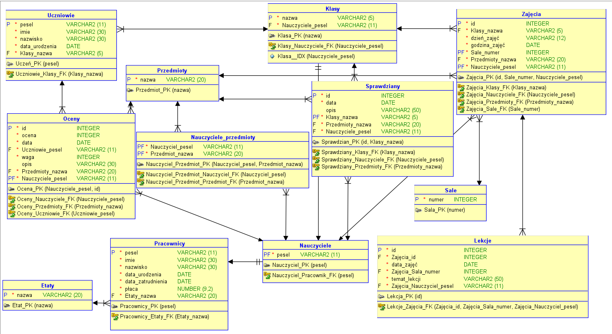
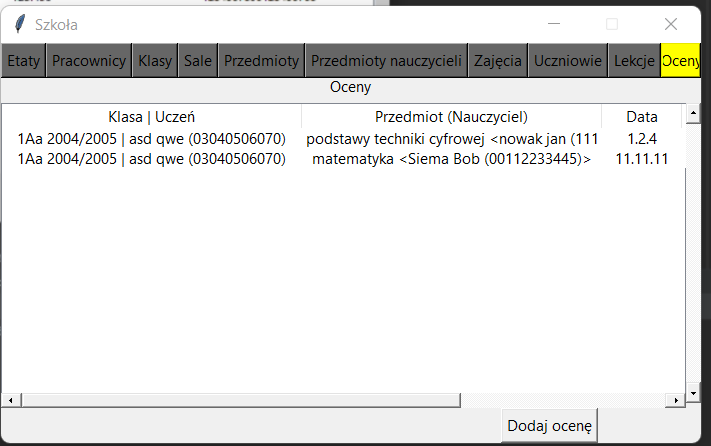
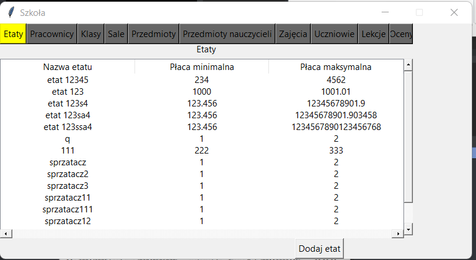

# PP_Term5_SQL_School

## O projekcie
Projekt na zaliczenie przedmiotu "Zarządzanie bazami SQL i NoSQL" z 5 semestru studiów na PP. 

- Projekt w Python 3.10
- Korzysta z sqlite3

## Cel projektu
Zaprojektowanie relacyjnej bazy danych i stworzenie aplikacji okienkowj obsługującej tą bazę.

# Schemat bazy danych

# Wygląd aplikacji
1. 

2. 

